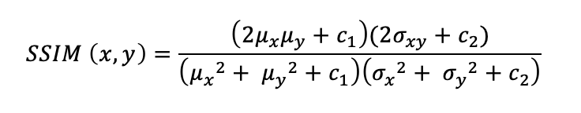

  
# Reproducibility Project:
# "Restoring Extremely Dark Images In Real Time" 

Group 9: Sahánd Wagemakers - 4880897, Luuk van Den Bent - 4886038, Annabel Hazewinkel - 4478223, Ethem Demir - 1544446.

Luuk & Ethem : RDB study
Annabel & Sahánd : Loss function analysis

This blog post is about the reproducibility of the Deep Learning paper “Restoring Extremely Dark Images In Real Time” by Mohit Lamba and Kaushik Mitra [1]. We have investigated alternative loss functions to the existing problem, as well as the effect of the (amount of) proposed RDB* modules compared to the original RDB modules. This research is conducted as part of the CS4240 Deep Learning course at Delft University of Technology. 

## Introduction

The original idea of the authors of the paper is that it is possible to train a network in such a way that it is capable of restoring extremely dark images in real time. They have studied low light enhancement solutions from the Computer Vision community and identified a need for a more ‘practical’ solution. This solution should ideally feature low network latency, less memory footprint, fewer model parameters, smaller operations count while maintaining high quality results. However, many current solutions compromise speed and thus are unable to work in real time. Additionally they involve high computational power, which would result in an expensive setup making it less suitable for mid to low range devices.

The authors propose a new deep learning architecture for extreme low-light single image restoration, which despite its fast & lightweight inference, produces a restoration that is perceptually at par with state-of-the-art computationally intense models.  The authors state that this architecture is 5 - 100x faster, 6 - 20x computationally cheaper and uses 3 - 11 fewer model parameters compared to state-of-the art. 

This was achieved by processing in higher scale -spaces allowing the intermediate-scales to be skipped. As can be shown in Figure 1, most current restoration networks use U-net style encoder-decoder wherein processing at lower scales causes significant latency and computational overhead. Therefore the authors proposed an architecture that jumps over these intermediate scales and operates at just three scales: the Lower Scale Encoder (LSE), the  Medium Scale Encoder (MSE) and Higher Scale Encoder (HSE).            

 *Figure 1. (a) Almost all methods rely on sequential processing. (b) The authors propose a parallel architecture for high inference speed.*
 
Another unique feature of the model is the ability to process all the scale-spaces concurrently as all the encoder scales operate directly on the input image and do not have any inter-dependencies resulting in high inference speeds. This is because the different encoder layers can be calculated in parallel. The architectural details of the model are shown on the left of figure 2. Five different blocks exist, the three encoders, LSE, MSE, HSE and the two Fuse Blocks 1 and 2. The output of the MSE and HSE is concatenated in the Fuse Block 1, while the output of this fuse block and the LSE is then concatenated in Fuse Block 2, resulting in the output of the entire model.

A crucial part of the HSE is the widely used Residual Dense Block (RDB), which is implemented three times in series, in order to extract abundant local features via dense connected convolutional layers, while enabling a contiguous memory (CM) mechanism [2]. The typical architecture of such an RDB block can be seen on the top right of figure 2. Three convolutional layers exist, and three ReLu blocks are being used after every layer. For the ReLU block the authors have decided to use the LeakyReLU non-linearity block with a negative slope of 0.2, as suggested by the paper “Seeing in the Dark” [3]. More uniquely, however, the authors have decided to modify the entire RDB block’s structure (into RDB*). According to the authors, non-linear rectification after each convolutional layer unnecessarily clips the negative values of feature maps, losing valuable information. Nevertheless, the rectifiers are necessary to infuse the model with sufficient non-linearity. Therefore, as in the RDB, each convolutional layer in RDB* passes a rectified output to subsequent convolutional layer, guaranteeing sufficient non-linearity in RDB*, yet different from RDB, not the rectified, but the non-rectified output of all layers is concatenated for the final layer. This architecture, shown in Figure 2, allows simultaneous processing of both rectified and non-rectified outputs, unlike the original RDB, avoiding losing information due to non-linear rectification. 

*Figure 2: Architectural details of the proposed model.*

## Reproduction

We found this network particularly interesting as there are many applications that real time restoration of extremely dark images can aid, such as pedestrian detection in low light conditions.
We decided to pursue investigating different loss functions with the same network, as well as architectural changes of the final HSE and the RDB* block itself. The reason for the loss function analysis is because the authors do not mention in the paper why this loss function is optimal.

To train the network, we used  a smaller part of the Sony dataset from the SID [3]. Once the training is completed, the network yields weights that can (theoretically) be used to restore any extremely dark image. 

In order to proceed with the project, first the runtime environment and hardware needed to be chosen and set up. Local personal computers were not equipped with sufficiently powerful processors, some not even with GPUs, and would result in training sessions lasting days to weeks, given the large dataset. Therefore, to allow progress and practical reproducibility, the training part of the deep learning network either needed to be done with a significantly reduced size of the dataset, potentially compromising the quality of the training or on dedicated hardware. Luckily, Google Cloud Platform service provides such dedicated powerful hardware for educational purposes. Before making use of this hardware, however, the code was analyzed on local runtime environments and Google Collab, which allows group collaboration on programming, where alterations to the code were tested and troubleshooted. Once there were no errors, this code was then uploaded to a remote virtual machine on Google Cloud Platform via the Git protocol and Github as our remote repository host. Google Cloud Platform is accessed purely via the SSH connection and the command line. The dataset also needed to be uploaded to the remote virtual machine. however, this posed difficulties to do directly, due to the size of the dataset and the upload and download speeds of personal computers. Therefore it was first compressed in a zip file, and then uploaded to a google drive via a fiber optic network connection, from which it could then be downloaded by means of the virtual machine’s terminal with the help of a software called “gdrive”.

The code itself is written in Python, alongside the PyTorch library in order to program this deep learning network. Also, although a CPU could be used for running this network, it is advised to use the GPU’s graphic processing capabilities. Based on these requirements, hardware for the virtual machine (VM) that was selected had an Intel Skylake CPU and a single core NVIDA Tesla T4 GPU with 30 GB Memory (made possible by 8 virtual processors). The software bundle that was selected was a Linux/Debian 10 optimized for use with PyTorch (version 1.10) and the CPU/GPU with CUDA 11.0. Finally a 100GB boot disk is used.

The full dataset from the SID paper [3] contains many raw images that together take up more than 100 GB of storage space. This would have resulted in more than 24 hours training, even with the powerful remote virtual machine, therefore the dataset needed to be reduced as well. It was ultimately reduced to an arbitrary amount of 47 training images and 27 test images. We only used images taken with a shutterspeed of 0.1s, to reduce variability in the data.

## General Code Adjustments 

The code provided in the repository alongside the paper was mostly stable. However, several changes were important to make to get the code fully working. A simple but necessary change in the train file used is to adapt the file location used to retrieve the data files: The locations provided in the github repository were incorrect for the repository itself. We set up the dataset location to be outside of the github folder to save space.
Figure 3 shows an example of how the locations in glob.glob were modified.

*Figure 3: The adapted glob.glob() locations.*

The other change needed to make the system work was in common_classes.py. In the latest version of the original github repository, a number of lines were commented out. It was unclear as to why this was the case, as the original code contains very little comments. However, simply uncommenting the lines shown in Figure 4 fixed the issue.

*Figure 4: The lines which needed to be uncommented.*

## Loss Functions
### Loss Function Analyis 
For training the network, the authors used the L1 Regularization loss function and the multiscale structural similarity index (MS-SSIM) loss function with a weightage of 0.8 and 0.2, respectively. In order to verify the performance of this combination, these loss functions were tested individually. The structural similarity index (SSIM) loss function was also tested for additional validation.

The L1 loss stands for Least Absolute Deviations (LAD) and is defined as follows [4]: 

The SSIM is defined as the structural similarity index measure and can be used to predict the perceived quality of images [5]. The MS-SSIM loss function is computed as follows: 

The multiscale structural similarity index (MS-SSIM) is an extension of the SSIM function that achieves better accuracy than the single scale SSIM approach but at the cost of relatively lower processing speed [6]. 

### Code Loss Function 
The loss function used can simply be adapted in the lines that define the loss within the while-loop for the training setup. Right before this while-loop, the loss functions can be defined. The code can be found in Figure 5.

*Figure 5: The code adapted for the loss function adaptation.*

### Results 
Since we reduced the amount of iterations for the training, we first wanted to confirm that our training indeed saturates. If we look at the loss curves shown in Figure 6, from the first iteration to the last, we can indeed see that although the loss is quite noisy, the performance does not really improve anymore after ~250.000 iterations. Therefore 500.000 iterations is (more than) enough.

*Figure 6: Different loss curves for different loss functions.*

What is important to note, is that the scales of the loss functions do not necessarily line up, meaning that we cannot simply compare the absolute values of the loss functions. What we can do is compare the general shapes. We see that all loss functions seem to converge very early on in the total training process, and then fluctuate around the same average for the rest of the session. At the halfway point(250.000 iterations), the learning rate is reduced by half, but this also does not seem to impact the training process by much.
The MS-SSIM Loss seems to behave somewhat differently, but the behaviour ends up the same: After around 150.000 iterations, the model converges. 

What we can gather from this, is that the model needs significantly less iterations than we thought at the start. The original model used a larger dataset and trained the model over 1.000.000 iterations. For the reduced dataset we use, around 150.000 to 200.000 iterations should be enough. While we do suspect that this indicates that our model does not generalize very well to other cameras compared to what the original paper claims, this should be evaluated further in the future.

In Table 1 we assess the performance of the different loss functions based on the metrics PSNR and SSIM. This is the average taken over all test files. 

*Table 1: Resulting metrics based on the loss functions used*

Looking at the average pnsr/SSIM metrics, We see that all our results perform worse than that of the paper with the larger dataset, albeit not significantly so. We also see that the baseline loss function(L1 + SSIM) has the highest peak signal to noise ratio. This indicates that even with the reduced dataset, the originally used loss function seems to perform the best when training the network.

To test the network weights on a set of images, the provided script demo.py can be used. Simply add the test input images to the Demo_imgs folder, along with the weights for the network. Subsequently running demo.py then outputs the generated .jpg files, which can be seen in figure 7. Do note that the weights file should be called weights for the python file to run correctly.

While this is hardly a quantitative analysis, as the difference between each result is very small, we see a few very small differences between the results. General image quality seems to be very similar, but there are some slight colouration differences: The bar underneath the table in the SSIM result is coloured more purple, and the baseline has slightly brighter leaves. Noise is apparent in all results, but the difference in noise patterns is not easily understood just from the images alone. However, it is interesting to see that the system performs relatively well with such a small dataset.

*Figure 7: Resulting images when applying the model on various test images*

*Figure 8: Another test image with a lower exposure time*

Another validation image which was not used for training is tested with a different exposure time(0.033s respectively instead of 0.1s), which can be found in figure 8. The system seems to perform significantly worse, judging on the noise and green hue, but the image is still clearly understandable. However, this is once again not a quantitative result, but rather a personal observation.

## Code RDB Block  
For the first training, the network.py file has been adjusted by changing the activation type in the convolution layers. In the RDB* module, the first, middle and last convolutional layers' activation functions are “false” (meaning disabled), “before”(meaning performing the nonlinear step before convolution) and “before” respectively, while reverting it to the original canonical RDB they all become “after”. This can be seen in the network.py file at lines 92, 97 and 102, in Figure 9.

*Figure 9. Adjustment of the activation functions.*

For modifying the number of RDB blocks in the HSE the network.py file needs to be edited again, but this time at lines 150 and line 151, where in the first line the third RDB initialisation is removed, and in the second line the settings of the convolutional layer are adjusted to accommodate for two sets of 64 input channels, rather than three. This is shown in Figure 10. 

*Figure 10. Adjustment of the number of RDB blocks.*

Finally, at line 188, the third RDB block itself is removed, and the concatenation is adjusted to only include the first and second RDB blocks. This is shown in Figure 11. 

*Figure 11. Removal of the third RDB block.*

Similar to the second training, for the third training the same blocks of codes are edited, but instead of removing RDB3, an RDB4 is added, and the concatenation is adjusted to 3 sets of 64 channels. This is shown in Figures 12 and 13. 

*Figure 12. Adjusting the number of RDB blocks to 4.*

*Figure 13. Addition of the fourth RDB block.*

###  Results
Again, we first take a look at the loss curves to guarantee saturation. As we saw for the loss functions, we see that although the loss is quite noisy, the performance does not really improve anymore after ~250.000 iterations which means that the training has saturated. This is shown in Figure 14.

*Figure 14: Different loss curves for different amount of RDB blocks.*

Next we look at some quantitative results, if we look at the average Peak Signal to Noise Ratio (PSNR) and Structural Similarity Index Measurement (SSIM). We can observe that our results also all perform worse than the original claim of the paper. This is most probably because of the use of less data. However it is worth noting that all our measurements are so close, that one outperforming the other is highly likely due to variance. Furthermore, when looking at these results, it is not abundantly clear that the proposed RDB* really outperforms the classical RDB (and even underperforms in this test).

*Table 2: Resulting metrics based on the different RDB blocks.*

To test the performance of the network, images are created from the network in the same way as described in the Loss function section. Although all images look very alike, there can be some little differences spotted in perceived brightness, as well as some small color distortions. However it is hard to visually decide which network really performed better, since the differences are so small.

## Discussion

Both the study on the loss functions and on the architectural changes provided similar results: the networks converged rather quickly(around 150.00K-250.00k) iterations, after which the loss function oscillated around an average. Qualitatively, the images resembled the baseline and did not vary much. In all cases, the metrics were very similar, but performed slightly worse to the baseline system. All networks with the reduced dataset did perform worse than the original with the full dataset. However, this diference in results on the testing set was small enough that the system could still be considered functinonal. This indicates that the system does not require as much training data and training time to fulfil its task. However, more research must be done to see how well this network with the reduced dataset generalizes to other cameras and datasets, something the original paper did claim it could. A quick qualitative test on an image with a different exposure time already showed signs of reduced performance(see figure  8).

While this reproducibility project did not provide any completely new insights, it did show off the robustness of the overal design of the network: Alternate loss functions and changes to the RDB architecture blocks did not show any significant increase or reduction in performance. However, without more tests, we do not have the statistical power to back up these claims for more general implementations. Therefore, we still recmomend more tests, with larger and more varied datasets as a continuation of our work. 

## References 
[1] M. Lamba and K. Mitra, “Restoring Extremely Dark Images in Real Time”, 2021 IEEE/CVF Conference on Computer Vision and Pattern Recognition (CVPR), 2021, pp. 3486-3496, doi: 10.1109/CVPR46437.2021.00349.

[2] Yulun Zhang, Yapeng Tian, Yu Kong, Bineng Zhong, and Yun Fu. Residual dense network for image super-resolution. In CVPR, 2018.

[3] Chen Chen, Qifeng Chen, Jia Xu, and Vladlen Koltun. Learning to see in the dark. In CVPR, 2018.

[4] Liu, Jun, and Jieping Ye. "Efficient l1/lq norm regularization." arXiv preprint arXiv:1009.4766 (2010).

[5] Hang Zhao, Orazio Gallo, Iuri Frosio, and Jan Kautz. Loss functions for image restoration with neural networks. IEEE Transactions on computational imaging, 3(1):47–57, 2016.

[6] M. Abdel-Salam Nasr, Mohammed F. AlRahmawy, A.S. Tolba, Multi-scale structural similarity index for motion detection, Journal of King Saud University - Computer and Information Sciences, Volume 29, Issue 3, 2017.

## Appendix

  
Original Raw Un-edited

  

  
  
  

  
  
Ground truth

  
  
  
  
  
  

  
  
Original Paper Results

  
  
  
  
  
  
  
  
  
  
  
  
  
  
  
  
  
  

  
  
Baseline

  
  
  
  
  
  
  
  
  
  
  
  

  
  
  
  
  

  
  
RDB* 2x

  
  
  
  
  
  
  
  
  
  
  
  

  
  
  
  
  

  
  
RDB* 4x

  
  
  
  
  
  
  
  
  
  
  
  

  
  
  
  
  

  
  
RDB

  
  
  
  
  
  
  
  
  
  
  
  

  
  
  
  
  

